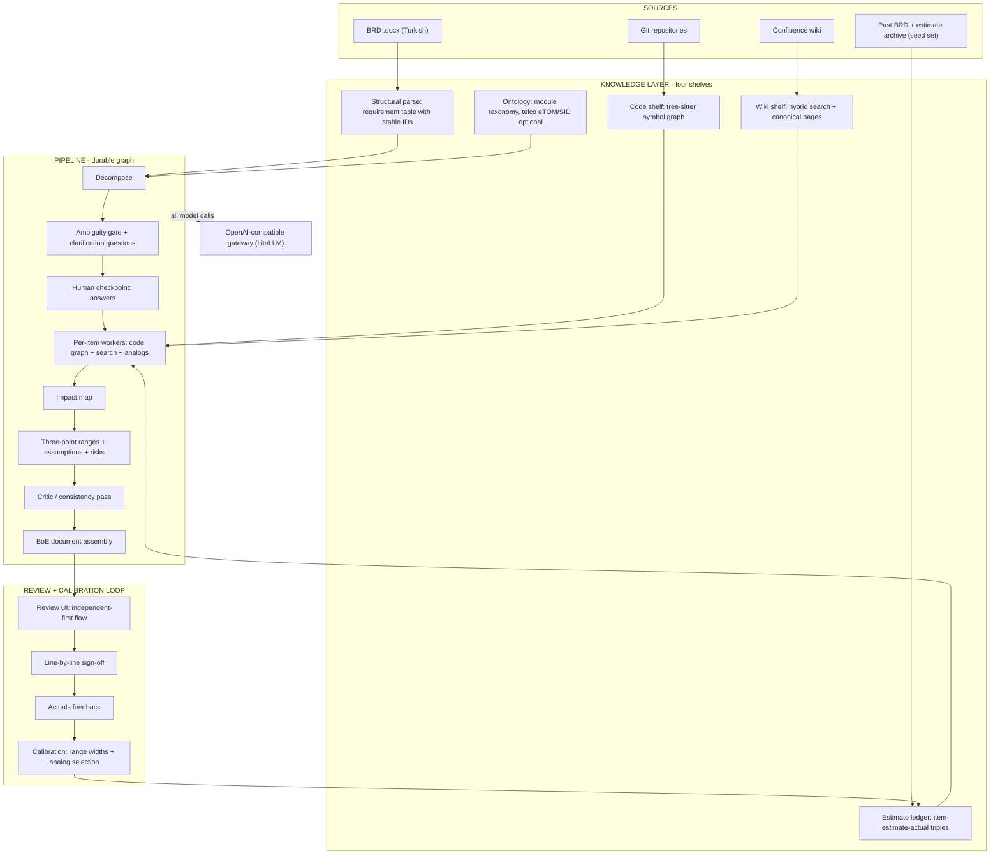

# Architecture Reference

Condensed from the founding research ([RESEARCH.md](RESEARCH.md) §5, fully sourced).
This file is the canonical technical map; decisions live in [adr/](adr/). The
sprint-by-sprint build order is in [ROADMAP.md](ROADMAP.md).

**Reconciled against the code on 2026-08-03, after S10.** The Status column below says
what is actually running, not what was planned — `shipped` means there is code and a
test; `partial` and `not built` say what is missing and why.

## System overview

## Components & chosen stack

Composition policy: established OSS is adopted behind internal interfaces; from-scratch
code is reserved for the differentiation core — see
[ADR-0005](adr/0005-oss-first-composition.md).

| Component | Choice | Status | Rationale / ADR |
|---|---|---|---|
| BRD parsing | `docling-slim` (structural .docx backend, imported directly to avoid the PDF chain), python-docx for BoE output | shipped `packages/parse` | Structural tables/headings from enterprise .docx; MarkItDown was not needed ([RESEARCH §5.6]) |
| Pipeline orchestration | LangGraph (durable graph, checkpoints, HITL interrupts) | shipped `packages/pipeline` | **Pydantic AI was deliberately not adopted** — its own model clients would bypass ADR-0001 |
| Model access | OpenAI-compatible client → deployment's LiteLLM gateway | shipped `packages/gateway` | The `openai` package is the *protocol* client and is confined to this one package; CI fails the build on a provider import anywhere else ([ADR-0001](adr/0001-litellm-gateway-only.md)) |
| API service | FastAPI, Python 3.13+ | shipped `apps/api` | Ecosystem fit with parse/pipeline packages |
| Storage | Postgres 18 + pgvector for ledger, runs, chunks, estimates | shipped (Alembic 0001–0010) | One database until scale demands more; tenant isolation is RLS ([ADR-0007](adr/0007-multitenant-auth.md)) |
| Wiki retrieval | Turkish FTS lexical + dense, fused with RRF (k=60), ACL pre-filter | **partial** `packages/knowledge` | Both shelves now have both legs. `embed_pending` (S11-8) writes vectors after each sync and via `estimo-embed`; `dense_ledger_ids` covers the ledger and `dense_chunk_ids`/`hybrid_chunk_ids` the wiki and code shelves — until the latter existed, chunk vectors were written and never read. Both dense legs carry the same ACL pre-filter as their lexical counterparts. **Unmeasured** — whether the dense leg improves Turkish ranking needs a live embedding endpoint (the S3-2 shoot-out). Still unbuilt: the cross-encoder rerank slot (S11-1) and contextual chunk headers (S11-2, itself blocked on there being no chunker). The TR lexical choice was measured, not assumed ([ADR-0004](adr/0004-turkish-first-pipeline.md)) |
| Code intelligence | tree-sitter symbol graph (Java/TypeScript) | **partial** `packages/code` | The MVP leg is shipped; SCIP indexes and generated module wikis are not built. Impact analysis is therefore heuristic — items it cannot resolve become explicit discovery-effort lines rather than silent guesses |
| GraphRAG | **Skipped in v1** | accepted | Free graphs already exist (code graph, page hierarchy); revisit only for multi-hop needs |
| Knowledge curation | Canonical pages tier outranks raw wiki; freshness + authority scores on chunks | accepted | Stale-wiki poisoning defense |
| Calibration | Analog retrieval + conformal-style quantiles on the **analog-transfer** error, recomputed per actual | shipped `packages/estimate` | The two evidence-backed accuracy levers (RESEARCH §3.2). Validated only on a 15-row synthetic ledger so far |
| Evals | Purpose-built offline harnesses over golden synthetic sets (`evals/`); Langfuse optional for online telemetry | shipped | Ragas/DeepEval/promptfoo were surveyed and not adopted — the scoring the gates need is deterministic and small. Naive-baseline reporting mandatory (PRINCIPLES #7) |
| Review UI | Next.js 16 / React 19; `en` default locale, `tr` first localization | shipped `apps/web` | Implements the delivered design system in `docs/design/`; OIDC login flow in the SPA is deferred ([UI-VISION.md](UI-VISION.md), [ADR-0004](adr/0004-turkish-first-pipeline.md)) |
| Connectors | Confluence v2 crawl (ACL+version metadata), Jira JQL cursor, git hosting via provider APIs + git protocol — **Bitbucket first-class**, GitHub, GitLab; HMAC-verified webhook re-index | shipped `packages/connectors` | Configured by form (clone URL + JSON), not an OAuth repo picker (S11-5). Bulk sync never via MCP (rate limits); [ADR-0002](adr/0002-atlassian-adjacent-core.md) |
| Atlassian surface | Estimo's own MCP server at `/mcp` (FastMCP 3, 3 read tools, OAuth2 resource server) | **partial** | The MCP server is shipped; the Forge Rovo Agent front-door is deferred — it is a client of already-shipped endpoints ([ADR-0002](adr/0002-atlassian-adjacent-core.md)) |
| Deployment | **Fully containerized** — multi-arch OCI images on GHCR with SBOM + provenance; `docker compose up` for dev/single-node; Helm (same images) for k8s | shipped `infra/helm` | Ladder SaaS → VPC → BYOC → air-gap; stateless per tenant. [ADR-0006](adr/0006-fully-containerized.md) |

## Indexing pipelines (ordered)

Three ingestion lanes feed the knowledge layer. Each is an **ordered, checkpointed,
resumable** pipeline — every stage idempotent, per-tenant namespaced, safe to re-run.

**Wiki lane** (Confluence → wiki shelf):
`crawl (v2 API, page+ACL+version, checkpointed)` → `normalize (HTML→markdown)` →
`dual index write (FTS + vector)` → `freshness/authority scoring`. The vector half runs
after each sync (S11-8) and re-embeds a row only when its text changed. One stage in the
original design is still **not built**: there is no chunker — a Confluence page becomes
ONE `knowledge_chunks` row, so "chunk" is currently a misnomer for "document". That is
also what blocks contextual headers (S11-2): a section header needs a section.
Incremental sync diffs page versions; a permission change re-syncs ACL metadata without
re-embedding. Canonical pages enter this lane post-approval with a rank boost.

**Code lane** (git hosting → code shelf):
`clone/fetch (Bitbucket/GitHub/GitLab APIs + git protocol)` → `tree-sitter symbol graph
(Java/TypeScript)`. The two later stages — a SCIP index for deterministic
defs/refs/dependents, and nightly module-wiki generation feeding the wiki lane — are
designed but **not built**. Webhook push events (or polling fallback) trigger incremental
re-index of changed paths only.

**Ledger lane** (seed import / live BoE writes → estimate ledger):
`ingest (import CLI or pipeline write)` → `validation vs schema
([LEDGER-SCHEMA.md](LEDGER-SCHEMA.md))` → `work-item embedding (title+description)` →
`error/review queues (unknown modules, rejected rows)`. Actuals arriving later update
calibration aggregates as a scheduled job.

**Query path** (at estimation time): `hybrid retrieve (Turkish FTS + dense, ACL pre-filter,
freshness-weighted)` → `RRF fusion` → `evidence assembly with URIs`. The rerank stage
between fusion and assembly is still **not wired** (S11-1). A deployment with no embedding
profile keeps running the lexical leg alone — the dense leg degrades to contributing
nothing rather than failing. Retrieval
never sees content the requesting user couldn't read at the source — with the caveat that
ACL keys are matched per connection, and `GET /v1/canonical` has no per-user filter yet
(S11-7).

## Non-negotiables encoded in code structure

- `packages/gateway/` is the **only** module importing an LLM client; CI greps for
  provider SDK imports elsewhere and fails the build. Model names never appear in code —
  stages name a *profile*, the deployment maps profiles to models.
- ACL metadata travels with every chunk from ingestion to retrieval; enforcement is a
  **pre-filter**, never prompt-level.
- Every pipeline stage emits evidence URIs; the BoE assembler refuses lines without them
  (PRINCIPLES #2 enforced mechanically).
- Judge model ≠ generator model in all eval and critic stages.
- Prompts are versioned files; changing one triggers the eval suite in CI.

## Known technical risks (tracked)

1. Static impact analysis holes on legacy Java (reflection, XML wiring, stored procedures)
   → hybrid SCIP + LLM judgment; low-confidence items get an explicit "discovery effort" line.
2. Turkish retrieval quality — embedder/reranker choices must be benchmarked on Turkish
   text (S3 spike, ADR-0004).
3. Confluence bulk sync is slow by platform design (no export API, points-based limits) —
   checkpointed incremental crawlers, days-long initial sync budgeted.
4. Ledger cold-start & data quality — seed-set import is a first-class product feature,
   not a script (S0/S3).
5. LLM-judge systematic bias — periodic human-labeled re-anchoring is scheduled work,
   not an afterthought.
