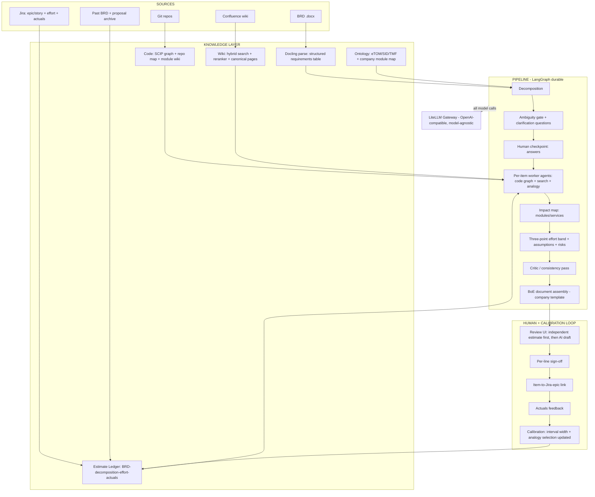

# Estimo — BRD → Evidence-Linked Draft Estimate
## Founding Research Dossier v1

*Date: August 3, 2026 · Method: 5 parallel research agents (market, evidence base, architecture, telco domain, open-source); every claim is source-linked. Unverifiable/speculative items are explicitly labeled. This file is the public version of Estimo's founding research; the decisions in §10 have been updated with the project owner's discovery answers. Originally authored in Turkish on 2026-08-03; translated to English as part of the repository's English-only documentation policy.*

---

## 0. Executive Summary

**The question:** Can we automate the BRD-to-draft-estimate process — which today ties up a BA + developer + lead + solution architect team for days — with an AI application fed by the codebase + wiki know-how + past effort experience, and would that make a product?

**The five-sentence answer:**

1. **The gap is real and verified.** As of August 2026, no product connects all four corners — (a) the customer's BRD, (b) the firm's own codebase, (c) the domain knowledge accumulated in the wiki, (d) the effort↔actuals history — into a single human-approved draft estimate document. The closest players cover at most two corners.
2. **But the honest evidence is this:** the literature does not say "an LLM on its own estimates as accurately as an experienced team" (a commercial tool hit ~16% accuracy in a controlled experiment). The two strongest levers are exactly what you already hold: **analogy from your own history** (+59% MAE improvement with few-shot) and **intervals calibrated on actuals data** (even experts' 90% intervals capture reality only 60–70% of the time — beating humans on calibration is achievable).
3. **The right product position:** not an "estimation machine" but a *Basis-of-Estimate* platform that produces **evidence-linked decomposition + missing-information questions + analogies + a calibrated effort band**, with every line signed off by a human.
4. **The moat is not in retrieval** — Atlassian announced Code Intelligence (EAP) at Team '26; code+wiki Q&A should be counted a platform freebie within 12 months. The moat: **workflow + the effort↔actuals ledger + the telco ontology (eTOM/SID) + customer-specific calibration.**
5. **The architecture is clear:** your own infrastructure running *alongside* Atlassian (REST bulk ingest, SCIP code graph, hybrid search, LangGraph pipeline), a thin Forge/Rovo agent surface on top; all model calls through the customer's **LiteLLM gateway** (model-agnostic, on-prem friendly); built entirely from MIT/Apache-licensed OSS building blocks — there is no ready-made core to buy, because **this core does not exist in OSS either.**

---

## 1. The Problem and Today's Process

A customer brings a new requirement → BRD (Word, high-level, business language) → a cross-functional team (analysis, dev, lead, business, solution architect) convenes → a **draft estimate** built on assumptions. The cost has three dimensions:

- **Calendar:** staff availability + meeting cycles; the draft takes days. In telco this delay has an industry-level benchmark: Totogi markets against a "7-day" baseline for the typical BSS CR cycle ([AWS ML Blog, Jan 2026](https://aws.amazon.com/blogs/machine-learning/how-totogi-automated-change-request-processing-with-totogi-bss-magic-and-amazon-bedrock/)).
- **Effort:** the most expensive people (architects, leads) get tied up in the same type of work over and over.
- **Inconsistency and lost knowledge:** the same work gets a different estimate from a different team; know-how is buried in individuals; when an expert leaves, the experience leaves too. (The literature confirms this: the same expert gives the same task different estimates at different times — [Jørgensen, JSS 2007](https://www.sciencedirect.com/science/article/abs/pii/S0164121207000714).)

**Target value proposition:** *"a 5-day cross-functional draft → a same-day, evidence-linked draft + clarification questions"* — with human approval never leaving the process.

---

## 2. Market Landscape (August 2026)

### 2.1 The four-corner test

| Product | Category | Takes in | Produces | Effort estimate? | Code / wiki / history? |
|---|---|---|---|---|---|
| [ScopeMaster](https://www.scopemaster.com/) | Requirements QA + sizing | User story / requirement text | Defect findings, COSMIC/IFPUG size, tests, diagrams | Size→benchmark effort | ✗ / ✗ / ✗ |
| [CAST](https://www.castsoftware.com/overview) | Code intelligence | Source code | AFP/AEP size, architecture map, MCP context | Retrospective only | Code ✓ / ✗ / ✗ |
| [Galorath SEERai](https://galorath.com/seerai/agents/estimation/) | Parametric estimation AI | Natural-language program inputs + historical cost data | WBS, cost/effort/risk models | **✓ (core)** | ✗ / ✗ / history ✓ |
| [Jira AI estimators](https://marketplace.atlassian.com/apps/1017505204/ai-estimator) | Marketplace app | Single Jira issue | SP/hour suggestion | Ticket level | ✗ / ✗ / Jira ✓ |
| [EltegraAI](https://www.eltegra.ai/brd-generation) | AI BA tool | Documents/conversation | BRD, tests, risks, **person-hours** | ✓ (ungrounded) | ✗ / ✗ / ✗ |
| [Provus](https://provus.ai/services-cpq/) | Services CPQ | Scoping inputs + past proposals | WBS, price, SOW | Proposal level | ✗ / ✗ / proposals ✓ |
| [Atlassian Rovo / Rovo Dev / Code Intelligence](https://community.atlassian.com/forums/Atlassian-AI-Rovo-articles/The-ultimate-TEAM-26-Rovo-announcement-overview-and-more/ba-p/3241987) | Platform AI | Jira+Confluence+repos (Teamwork Graph) | Search/chat/agents, code plans, PR review | **✗** | Code+wiki+tickets ✓ / calibration ✗ |
| [Copilot coding agent](https://github.com/newsroom/press-releases/coding-agent-for-github-copilot) / [Spec Kit](https://github.com/github/spec-kit) | Dev agent | GitHub issue + repo | Plan → code → PR | ✗ | Code ✓ |
| [Devin + DeepWiki](https://cognition.com/blog/deepwiki) | Dev agent | Task + private repo | Repo wiki, plan, code | ✗ | Code ✓ (deep) |
| [Jellyfish / LinearB / Faros / Swarmia](https://pensero.ai/blog/jellyfish-vs-linearb) | Eng intelligence | Git/Jira telemetry | Metrics, capacity, delivery forecasts | In-flight work only | Telemetry ✓ / requirements ✗ |
| [Responsive / Loopio / AutogenAI](https://autogenai.com/blog/best-rfp-software-2026/) | RFP automation | RFP + content library | Draft responses, compliance matrix | ✗ | Past responses ✓ |
| [Totogi BSS Magic](https://aws.amazon.com/blogs/machine-learning/how-totogi-automated-change-request-processing-with-totogi-bss-magic-and-amazon-bedrock/) | Telco CR automation | SoW/CR + ontology | Spec→code→test (CR *implementation*) | ✗ (no commercial effort document) | Ontology ✓ / calibration ✗ |

**Conclusion:** The intersection of the four corners — the BA/lead/architect team's *draft-estimate workflow*, with affected-module evidence and calibrated hours — is **empty.**

### 2.2 Notes on the critical players

- **Atlassian = both the distribution channel and the erosion clock.** Rovo Dev is GA ($20/dev/month), AI work-breakdown in Jira is GA, and Teamwork Graph is open to third parties via MCP (open beta) — but **effort estimation is nowhere in it**; "suggest story points from historical data" is still an open feature request ([AI-104](https://jira.atlassian.com/browse/AI-104)). **Code Intelligence at Team '26 (EAP)** — intent-level code queries across multiple repos — could commoditize this idea's retrieval layer within 12 months. Strategy: don't fight the platform, ride on top of it; build the moat elsewhere.
- **Galorath SEERai** (Oct 2025, "production beta") is philosophically the closest competitor: agentic, auditable, estimation grounded in historical data. But it comes from the parametric cost-model world (defense/government programs); **it has no code or wiki grounding**. Borrow its defensibility language; stay out of its territory.
- **Dev agents** (Copilot coding agent, Devin, Cursor Plan Mode, Amazon Q) have commoditized code-grounded *plan* generation — but the input is a ticket and the output is a developer plan; **no BRD scale, no effort quantification, no assumption/risk register.** They are not competitors; they can be used as *subcontractors* inside the pipeline (an impact-analysis subroutine).
- **The large SIs** (Accenture GenWizard, Infosys Topaz) keep estimation AI as an internal margin tool and do not productize it. The counter-move: **productized transparency** — an estimate the customer can audit beats a black-box accelerator. The initial ICP is therefore the **mid-size vendor/SI**: too small to build this itself, big enough to enter tenders.
- **Price anchors:** Rovo Dev at $20/dev/month; Glean-class platforms at $50–100k pilots → $500k expansions. Given bid-desk economics, **a five-figure annual platform fee + per-estimate consumption** is defensible.

---

## 3. The Evidence Base: How Much Accuracy to Expect?

### 3.1 Raw LLM estimation: modest

- The most important finding in the story-point literature is a **replication**: once metric errors are corrected, deep models (Deep-SE, GPT2SP) are **no better than naive mean/median baselines** ([Tawosi et al., IEEE TSE 2023](https://arxiv.org/pdf/2209.00437)). "The problem is not solved."
- The only controlled human comparison: effort estimation with GitLab Duo on a real system hit **~16% accuracy — "insufficient for industry standards"**; yet participants found the tool valuable for *work breakdown* and preferred hybrid use ([MDPI Applied Sciences 14(24):12006, 2024](https://www.mdpi.com/2076-3417/14/24/12006)).
- Promising but unproven: multi-agent consensus estimation ([ASE 2025](https://arxiv.org/abs/2509.14483)).

### 3.2 The levers that work: analogy + calibration

- **Few-shot analogies selected from past work improved MAE by an average of 59.3% over zero-shot** ([SSBSE 2023](https://arxiv.org/pdf/2403.08430)) — *which analogy you show matters more than which model you use.*
- Generic RAG, by contrast, made no meaningful difference ([arXiv 2026](https://arxiv.org/html/2604.03443v1)): what works is **analogy from the same team's/domain's history, not generic embedding search**. The academic rationale is ready-made: reference class forecasting / the outside view ([2025 review](https://www.tandfonline.com/doi/full/10.1080/09537287.2025.2578708)).
- **The human baseline is not as high as assumed:** average effort overruns of 30–40% ([Moløkken & Jørgensen](https://web-backend.simula.no/sites/default/files/publications/SE.3.Moloekken-Oestvold.2004.pdf)); experts' 90% confidence intervals capture reality only 60–70% of the time ([Jørgensen et al., IEEE TSE 2004](https://www.researchgate.net/publication/3188408)). Intervals derived from the historical error distribution beat expert intervals — **the first winnable battle is calibration, not accuracy.**

### 3.3 Findings that become design requirements

1. **Anchoring is a design requirement.** Numeric anchors have a very large effect on expert estimates (Cohen's d ≈ 1.19, [JSS 2015](https://www.sciencedirect.com/science/article/abs/pii/S0164121215000618)); people cling to AI suggestions with insufficient adjustment ([Steyvers & Kumar 2024](https://journals.sagepub.com/doi/full/10.1177/17456916231181102)); LLMs anchor almost as strongly as humans (anchoring index ≈0.37 vs ≈0.49, [JBEF 2024](https://www.sciencedirect.com/science/article/pii/S2214635024000868)) and carry over the human biases present in the request format ([FSE 2025](https://dl.acm.org/doi/pdf/10.1145/3715771)). → Product flow: **the human's independent preliminary estimate first, then the AI draft**; customer budget/date anchors in the BRD are **quarantined** from the estimation prompt; a "consider-the-opposite" step is built into the pipeline.
2. **An LLM's verbalized confidence is unusable** — systematic overconfidence ([ICLR 2024](https://arxiv.org/abs/2306.13063) and follow-ups). Uncertainty = sampling variance + **conformal prediction** (calibration set = your own effort↔actuals history) + intervals from the historical error distribution.
3. **The ambiguity gate comes before estimation.** Requirement ambiguity measurably degrades LLM output ([arXiv 2026](https://arxiv.org/html/2604.21505v1)); generating clarification questions is still a weak spot for LLMs ([ClarifyCodeBench 2026](https://arxiv.org/pdf/2607.00711)), but company-specific few-shot with 10+ examples has shown a +20% improvement in an industrial setting ([ICSME 2025](https://www.ipr.mdu.se/pdf_publications/7221.pdf)). → The rule "no effort is assigned to an unclarified item" is a product principle.
4. **An honesty requirement:** in the pilot, every result is reported **against a naive baseline** (team median) — the trap the literature exposes is that sophisticated models fail to beat it. The measurement set: MAE/MdAE, Pred(25), interval coverage rate, human-vs-AI-vs-hybrid delta, anchoring delta, post-question revision rate. Second-order effects are tracked as well: [DORA 2025](https://dora.dev/dora-report-2025/) shows AI use can increase WIP and rework — speed alone is not a success metric.

---

## 4. The Telco Domain Layer

- **eTOM L2/L3 + SID + TMF Open APIs (100+) + the ODA component inventory form a ready-made ontology for decomposing a BRD** ([TM Forum eTOM](https://www.tmforum.org/open-digital-architecture/process-framework-etom/), [Open APIs](https://www.tmforum.org/oda/open-apis), [IG1242](https://www.tmforum.org/resources/introductory-guide/oda-component-inventory-v21-0-0-ig1242/)). There is precedent, too: the **"The Big Deal Phase II" Catalyst** (CSG + Blue Planet + Infosys; champions Orange Business, Vodafone, IOH — Jul 2026) turns an enterprise RFP into an editable quote running over TMF APIs + SID + the Intent model ([TM Forum Inform](https://inform.tmforum.org/research-and-analysis/proofs-of-concept/using-ai-and-standards-to-transform-complex-b2b-quoting-and-ordering)). That is *connectivity-service quoting* — not software delivery effort; the gap remains on our side. The first demo moment: the **BRD → (eTOM process, SID entity, affected component/API) → work item** map.
- **Sizing must be bilingual:** the primary output is a person-day WBS (what everyone uses); the optional layer is IFPUG/Nesma/COSMIC FP (the language of contracts and audits). The official recipe for CR sizing is Nesma's enhancement-FPA guide — it requires a baseline FPA; **automatically deriving a baseline FPA for the customer's installed system is a moat feature in its own right** ([Nesma v2.3](https://nesma.org/wp-content/uploads/2020/10/FPA-for-Software-Enhancement-v2.3-EN.pdf)). Caution: the size-cost correlation collapses for micro-CRs of ≤5 CFP ([DiVA study](https://www.diva-portal.org/smash/get/diva2:836007/FULLTEXT01.pdf)) → a fixed-overhead floor for small work.
- **[ISBSG](https://www.isbsg.org/development-and-enhancement-data/) for cold-start calibration:** 13,147 projects, with telecom the largest slice of the industry mix at ~25%; cost/FP bands (P25–P75, roughly €200–1,200 depending on size band) can serve as an external prior ([ISBSG 2023 analysis](https://www.isbsg.org/wp-content/uploads/2023/03/Short-Paper-2023-02-Analysis-Project-Cost-per-FP.pdf)). The real calibration curve always comes from the customer's own history.
- **The anatomy of a professional estimate document** (a McConnell + Jørgensen + PMI synthesis): scope basis + explicit exclusions, an **assumption register**, a sized decomposition, three-point ranges + a confidence level, a **risk register + contingency**, the cone-of-uncertainty stage ([McConnell](https://athena.ecs.csus.edu/~buckley/CSc231_files/McConell_ConeofUncertainty.pdf): a 4x/16x band at inception), **basis-of-estimate provenance** (which past project/wiki page/code module supported which line), and a sign-off trail. **This document is the product itself.**
- **Governance is a sales feature:** PMI's first global AI-in-project-work standard, published in 2026, requires a **human sign-off** before AI findings become outcomes; aligned with the EU AI Act / ISO 42001 ([PMI](https://www.pmi.org/about/press-media/2026/pmi-publishes-worlds-first-global-standard-for-ai-in-project-work)). "Auditable estimate" is a direct selling argument to a telco PMO.
- **The Türkiye reality** *(labeled as speculation — must be verified through local discovery)*: operator-vendor CR pricing is most likely a person-day rate card inside a framework agreement; FP appears in public-sector/banking tenders. Entry is via the person-day workflow, with the FP compliance layer optional.
- **The vendor landscape:** Amdocs amAIz / Netcracker GenAI sit on the customer-experience side; Amdocs uses GenAI internally in its own SDLC ([Q4 FY25 earnings](https://www.fool.com/earnings/call-transcripts/2025/11/11/amdocs-dox-q4-2025-earnings-call-transcript/)); Ericsson is putting agents into BSS *configuration*. **Nobody is automating the commercial effort document between operator and vendor** — even Totogi automates the CR's *implementation*, not the estimate carrying price/assumptions on top of it. Our wedge sits exactly there, **one step above Totogi.**

---

## 5. Reference Architecture

### 5.1 Ingest: REST, not MCP

- **Confluence:** there is no space-export API ([CONFSERVER-40457](https://jira.atlassian.com/browse/CONFSERVER-40457)) → page-by-page, checkpointed crawl via the v2 API, together with page/space **restriction (ACL) and version** metadata. Points-based rate limits from March 2026 onward ([docs](https://developer.atlassian.com/cloud/confluence/rate-limiting/)) — the initial sync of a large wiki can take days; plan for it.
- **Jira:** the old `search` endpoint was removed (Oct 2025) → cursor sync via `POST /rest/api/3/search/jql`; epic/story/estimate/actual/link fields.
- **Atlassian MCP** (~1,000 requests/hour org-wide, [rate-limit reports](https://github.com/atlassian/atlassian-mcp-server/issues/171)) is for **interactive enrichment** only; bulk sync never goes through MCP. Teamwork Graph MCP (open beta) may be consumed but is **never made a hard dependency**.

### 5.2 The knowledge layer — four shelves

| Shelf | Content | Technology |
|---|---|---|
| **Code** | Deterministic symbol graph (defs/refs/dependents), token-budgeted repo map, an auto-generated per-module "purpose + interface + owner" wiki | [SCIP](https://github.com/sourcegraph/scip) (scip-java/scip-typescript; open governance since Mar 2026) + [tree-sitter](https://github.com/tree-sitter/tree-sitter) + an Aider-style repo map + a fork of [deepwiki-open](https://github.com/AsyncFuncAI/deepwiki-open) (rerouted to LiteLLM) |
| **Wiki** | Hybrid BM25+dense + contextual chunk headers + a reranker; ACL + freshness/authority score on every chunk; on top, **canonical pages**: human-approved, versioned, distilled domain briefs (they outrank the raw wiki in retrieval) | The [Anthropic contextual retrieval](https://www.anthropic.com/engineering/contextual-retrieval) pattern (up to −67% in retrieval failures); GraphRAG is **skipped** in v1 — the code graph, Jira links, and page hierarchy are already a free graph |
| **Estimate ledger** | BRD → decomposition → estimated effort → actuals triples; the main corpus for analogy retrieval, the calibration set for calibration | Your own schema + [TAWOS](https://github.com/SOLAR-group/TAWOS) / ISBSG priors for cold start |
| **Ontology** | Mapping of eTOM L2/L3, SID domains, TMF APIs ↔ the company's module/service taxonomy | Static map + LLM-assisted mapping; GenWizard-style code→capability reverse-engineering ingest for cold start |

### 5.3 Pipeline

**LangGraph** (MIT; checkpointing + human-in-the-loop interrupts) as the durable state machine; typed structured output at the nodes via **Pydantic AI**. The flow: Docling parse → decomposition (ontology-guided) → the **ambiguity gate** (no effort for unclarified items; questions are generated) → human answer checkpoint → per-item worker agents (tools: code-graph traversal, hybrid search, ledger analogy queries) → impact map → three-point effort + assumptions/risks → critic/consistency pass (order-randomized, judge ≠ generator) → the **BoE document** in the company template via python-docx. Every line carries an evidence URI: `file+line`, `pageID+version`, `issue-key`.

### 5.4 LLM access: the LiteLLM constraint is an advantage

The customer's **LiteLLM gateway** (MIT core; ~55k stars; OpenAI-compatible proxy) is the single model gate:

- **No** provider SDKs — an OpenAI-compatible client only; everything, embeddings included, goes through the gateway so the model/embedder stays swappable. (This rules out provider-bound frameworks like the Claude Agent SDK.)
- The gateway's budget/rate-limit **429**s are a first-class state; retry/backoff + a degradation plan.
- Known operational cautions: memory growth under high concurrency, spend-log slowdown past ~1M rows, the **March 2026 PyPI supply-chain incident → pin versions** ([sources](https://github.com/BerriAI/litellm)).
- Prompts are versioned; a format change is treated as a model change (format-bias evidence, [FSE 2025](https://dl.acm.org/doi/pdf/10.1145/3715771)).
- In the on-prem tier, open-weight models (Qwen 3.x / GLM / DeepSeek class) are realistic for structured tasks in 2026; frontier models only for the decomposition/reasoning nodes.

### 5.5 The Atlassian surface and delivery

- The heavy lifting runs on your own infrastructure **alongside Atlassian** (Forge FaaS cannot carry this pipeline; data egress forfeits "Runs on Atlassian" anyway).
- A thin surface on top: a **Forge Rovo Agent** front door (triggering from inside Jira/Confluence), plus the product's own **MCP server** (estimates queryable from inside Rovo/Copilot/Claude — the expected practice in 2026).
- The delivery ladder: SaaS (per-tenant index namespaces + KMS) → single-tenant VPC → **BYOC** (the telco buyer's middle road in 2026) → Replicated-style air-gap. Helm-packaged, stateless per-tenant pipeline.

### 5.6 OSS stack (all safe for commercial use)

**ADOPT:** Docling (MIT, LF AI & Data — primary .docx parser) · python-docx (MIT — the output document) · MarkItDown (MIT — lightweight fallback) · LangGraph (MIT) · Pydantic AI (MIT) · LlamaIndex **or** Haystack (MIT/Apache-2.0 — pick one) · LightRAG (MIT — if a wiki graph layer is needed) · tree-sitter (MIT) · SCIP (Apache-2.0) · repomix (MIT) · Langfuse (MIT — self-hosted observability/feedback) · Ragas + DeepEval + promptfoo (Apache/MIT — offline golden-set CI) · TAWOS (Apache-2.0 — benchmark data).

**FORK:** deepwiki-open (MIT — with its LLM calls rerouted to LiteLLM). **LEARN-FROM:** the Onyx connector architecture (caution: **Confluence/Jira ACL sync is Enterprise-only** — a clean-room rewrite is required), Microsoft GraphRAG, the Aider repo map.

**Red flags:** the Arize Phoenix server is **ELv2** (embedding/reselling requires legal review) · Restate is **BUSL-1.1** · stack-graphs is **archived** · the Sourcegraph core has been closed since 2024 · block copying code from `ee/`/`enterprise/` directories inside MIT repos with a CI path guard.

**Build-vs-buy verdict: buy nothing.** The estimation core does not exist in OSS; the differentiation budget goes into the decomposition→retrieval→calibration chain. *(Sourcegraph Enterprise was noted as a legitimate "buy" alternative for the code layer.)*

---

## 6. Product Principles Derived from the Evidence

1. No point estimates — **three-point ranges + cone-of-uncertainty stage + confidence level.**
2. **No line without an evidence link** (basis-of-estimate provenance).
3. **Questions first** — no effort is assigned to an item that has not passed the ambiguity gate.
4. **The human's independent estimate first,** then the AI draft; the delta is logged (anchoring telemetry).
5. Customer budget/date anchors are **quarantined** from the estimation context.
6. A verbal "90% sure" is banned — uncertainty comes from sampling variance + conformal + the historical error distribution.
7. Every pilot result is reported **against a naive baseline.**
8. Reviewer corrections are a **first-class signal**: they feed retrieval ranking and calibration.
9. Every line is **human-signed** (aligned with PMI's 2026 AI standard); the sign-off trail is part of the product output.
10. Wideband-Delphi-in-the-loop: the AI draft is distributed to the team **anonymously**, and divergences are surfaced.

---

## 7. Moat Analysis and "Why You"

**Moat ranking** (in order of defensibility):

1. **The effort↔actuals ledger** — no competitor can backfill it; every delivered project deepens the moat. Instrument it from day one (estimate line ↔ Jira epic ↔ actual linkage).
2. **Workflow + artifact** — a commercial-grade, auditable BoE document; neither RFP tools nor dev agents produce one.
3. **The telco ontology map** — BRD→eTOM/SID/TMF mapping + automatic baseline FPA for the customer's installation.
4. **Customer-specific calibration curves** — per team/domain.

**Retrieval and code Q&A are not moats** — Atlassian Code Intelligence, DeepWiki and their peers are commoditizing this layer.

**Why us:** Three knowledge-layer patterns that matured in the founder's earlier internal agent-infrastructure work map one-to-one onto this product's core — and the independently conducted architecture research arrived at the same patterns:

| Pattern from prior work | Its counterpart in Estimo |
|---|---|
| Canonical pages (distilled, approved knowledge) | The human-approved domain-brief layer that outranks the raw wiki in retrieval |
| Feedback-driven retrieval | Reviewer corrections feeding ranking + calibration |
| Search-first context (transcript ≠ working context) | Worker agents pulling context via tool calls; no context-stuffing |

The knowledge core's design is ready; Estimo layers the estimation workflow on top of it.

---

## 8. Roadmap

| Phase | Duration | Content | Exit gate |
|---|---|---|---|
| **0 — Retrospective golden set** | 2–4 weeks | Compile 10–20 past BRDs + estimated efforts + actuals; audit Jira actuals quality; set up ISBSG/TAWOS priors; measure the naive baseline | Does the ledger hold enough triples? (if not, product strategy shifts to "questions+decomposition first") |
| **1 — PoC** | 4–8 weeks | Parse→decomposition→questions→analogy→draft BoE; single domain/team; blinded on the golden set: AI-only vs human-only vs hybrid | Hybrid ≥ human-only (calibration + turnaround); reviewer correction rate within the acceptance band |
| **2 — Pilot** | 1 quarter | Live BRD flow, review UI (independent-first flow), edit telemetry, calibration dashboard, Langfuse feedback | Cycle time ↓, interval coverage ↑, team NPS |
| **3 — Productization** | afterwards | Multi-tenant, BYOC, Forge Rovo Agent surface + its own MCP server, FP/COSMIC layer, Marketplace; TM Forum Catalyst application in 2027 ("the cheapest credibility") | Second tenant onboarding < 2 weeks |

---

## 9. Risks

| Risk | Impact | Mitigation |
|---|---|---|
| Actuals data in Jira is dirty/missing (calibration starvation) | The product's main moat stays empty | Phase 0 data audit; proxy metrics where worklogs are absent; a data-hygiene step in onboarding |
| Atlassian Code Intelligence commoditizes retrieval | Perceived differentiation erodes | The moat lives in workflow+ledger; ride the Atlassian surface early |
| Static-analysis blind spots in legacy BSS Java (reflection, XML wiring, stored procs) | Incomplete impact map | Hybrid SCIP + LLM judgment; propose a "discovery effort" item for low-confidence items |
| Anchoring: the team clings to the AI draft | Estimate quality degrades systemically | Independent-first flow, anonymous Delphi, anchoring telemetry |
| Wiki staleness/contradictions produce evidence-backed falsehoods | Loss of trust | Freshness/authority scores, canonical-pages curation, versions in evidence links |
| Systemic LLM-judge bias silently corrupts evals | Wrong direction | Periodic re-anchoring with human labels; awareness that an ensemble ≠ a cure |
| On-prem model quality gap + GPU cost | Friction in telco sales | Task-based model split (frontier only for reasoning nodes); the BYOC middle road |
| Fast drafts → WIP/rework increase (the DORA effect) | "Automation theater" | Delivery metrics on the dashboard too; estimate speed is not the only KPI |
| The FP-expectation assumption for Türkiye may be wrong | Wrong feature priority | Local discovery; a person-day-first strategy |

---

## 10. Idea-Sparring Agenda

**My position (open to challenge):** This product should be founded not as an "AI effort estimator" but as a **"Grounded Basis-of-Estimate platform."** The initial value promise is not even the effort number: *same-day evidence-linked decomposition + clarification questions + analogy cards*; the effort band starts with a beta badge and earns trust as the ledger fills. Dogfood-first (on your own team), but the architecture is built like a multi-tenant product from day one. *(Product name: **Estimo** — from the Latin "aestimo": I estimate, I appraise.)*

Decision items:

| # | Decision | Options | Recommendation |
|---|---|---|---|
| K1 | First user | (a) dogfood on your own team → productize · (b) external product from the start | ✅ **DECISION: (a) + open source** — dogfood with an internal-efficiency goal, developed in parallel as an open-source product |
| K2 | Atlassian relationship | (a) fully independent · (b) thin Forge/Rovo surface + independent core · (c) deep Atlassian-native | **(b)** — the balance of distribution channel + erosion insurance |
| K3 | Initial output emphasis | (a) effort band up front · (b) decomposition+questions up front, effort in beta | **(b)** — the evidence base says so (the 16% experiment vs work-breakdown satisfaction) |
| K4 | Effort unit | (a) person-day WBS · (b) FP/COSMIC · (c) bilingual | **(c)**, person-days primary |
| K5 | Data reality | Actual/worklog quality in Jira unknown | ✅ **ANSWER: actuals are not in Jira** — past BRDs + estimated efforts will be compiled from the archive and loaded as a retrospective **seed set**; Phase 0's main job is this import pipeline |
| K6 | Relationship to prior internal patterns | (a) design from scratch · (b) adopt the matured knowledge-layer patterns as the core | ✅ **(b)** — canonical pages, feedback-driven retrieval, and search-first context are adopted into the core |
| K7 | Scope boundary | Draft estimate only, or extend into RFP responses/SOW | **BoE only** in v1; integration with RFP tools (a channel, not a competitor) |

**Discovery answers (2026-08-03):** BRDs are **Turkish** — the pipeline will be designed TR-first (see ADR-0004). Actuals data is not kept in Jira; the ledger is seeded by a **retrospective import of the past BRD + effort archive**. The goal is dual: internal company efficiency + an open-source product. **Still open:** BRD template variety and the archive's format/scope (to be clarified with the Phase 0 inventory).

---

## Appendices

### A. Agent reports — primary sources

- **Market:** ScopeMaster, CAST, Galorath SEERai, EltegraAI, Provus, Atlassian Team '26, Copilot/Devin/Q/Cursor/Jules/Amp, Jellyfish/LinearB/Faros, Responsive/Loopio/AutogenAI, GenWizard/Topaz — see the table links in §2.
- **Evidence:** the TSE 2023 replication, the MDPI 2024 GitLab Duo experiment, SSBSE 2023 few-shot, FSE 2025 format bias, JSS 2015 anchoring, TSE 2004 interval realism, ICLR 2024 calibration, ICSME 2025 ambiguity, DORA 2025 — see the links in §3.
- **Telco:** ISBSG 2023 cost/FP, Nesma enhancement-FPA, the TM Forum Big Deal Catalyst (Jul 2026), the Totogi AWS blog (Jan 2026), the PMI AI standard (2026), the McConnell cone — see the links in §4.
- **Architecture:** Atlassian MCP limits, the Confluence rate-limit change (Mar 2026), Forge consumption pricing (Jan 2026), Anthropic contextual retrieval, SCIP open governance (Mar 2026), voyage-code-3 / rerank-2.5, BYOC patterns, MCP stateless HTTP (Jul 2026) — see the links in §5.
- **OSS:** all license/health verifications taken from the repo pages on 2026-08-03 — see §5.6.

### B. Known unknowns

EstimAI GA status · Provus AI de-facto GA · SEERai maturity beyond vendor PR · the Atlassian Code Intelligence GA timeline · RAGFlow ACL behavior · Portkey relicensing · Türkiye FP practice (all on the re-check list).
