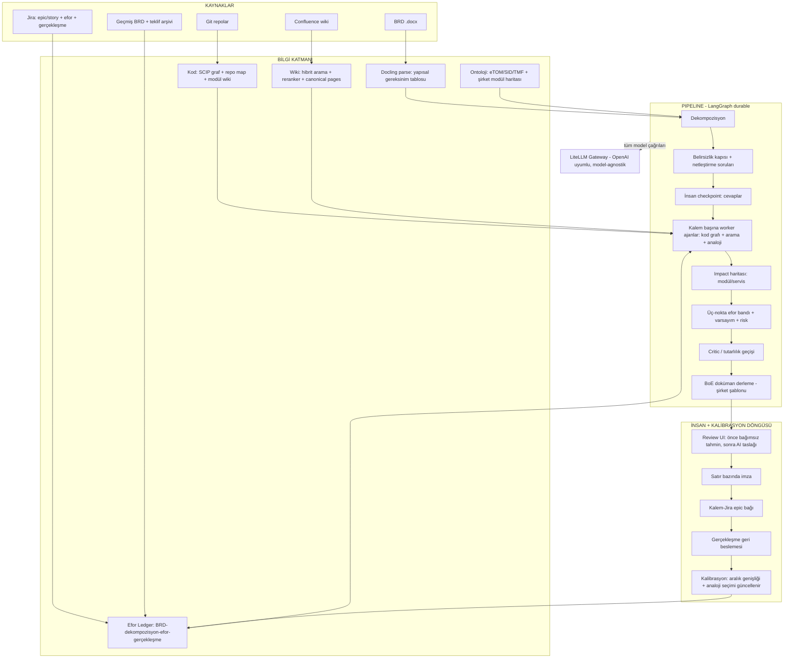

# Lodestar — BRD → Kanıtlı Taslak Efor
## Kuruluş Araştırma Dosyası v1

*Tarih: 3 Ağustos 2026 · Yöntem: 5 paralel araştırma ajanı (pazar, kanıt tabanı, mimari, telco domain, open-source), tüm iddialar kaynak linkli. Doğrulanamayan/spekülatif maddeler açıkça etiketlendi. Bu dosya, Lodestar'ın kuruluş araştırmasının kamuya açık sürümüdür; §10'daki kararlar proje sahibinin discovery cevaplarıyla güncellenmiştir.*

---

## 0. Yönetici Özeti

**Soru:** BRD'den taslak efora giden, bugün BA + developer + lead + solution architect kadrosunu günlerce meşgul eden süreci; kod tabanı + wiki know-how'ı + geçmiş efor tecrübesiyle beslenmiş bir AI uygulamasıyla otomatize edebilir miyiz — ve bu bir ürün olur mu?

**Beş cümlelik cevap:**

1. **Boşluk gerçek ve doğrulandı.** Ağustos 2026 itibarıyla hiçbir ürün, dört köşeyi — (a) müşteri BRD'si, (b) firmanın kendi kod tabanı, (c) wiki'de birikmiş domain bilgisi, (d) efor↔gerçekleşme tarihçesi — tek bir insan-onaylı taslak efor dokümanına bağlamıyor. En yakın oyuncular en fazla iki köşeyi tutuyor.
2. **Ama dürüst kanıt şu:** literatür "LLM tek başına deneyimli takım kadar isabetli tahmin yapar" demiyor (kontrollü bir deneyde ticari bir aracın isabeti ~%16). En güçlü iki kaldıraç tam da sizin elinizdekiler: **kendi geçmişinden analoji** (few-shot ile +%59 MAE iyileşmesi) ve **gerçekleşme verisiyle kalibre edilmiş aralıklar** (uzmanların %90 aralıkları bile gerçeği yalnızca %60–70 yakalıyor — kalibrasyonda insanı geçmek mümkün).
3. **Doğru ürün konumu:** "tahmin makinesi" değil; **kanıt-bağlantılı dekompozisyon + eksik-bilgi soruları + analoji + kalibre edilmiş efor bandı** üreten, her satırı insan imzalı bir *Basis-of-Estimate* platformu.
4. **Hendek retrieval'da değil** — Atlassian, Team '26'da Code Intelligence'ı (EAP) duyurdu; kod+wiki soru-cevap 12 ay içinde platform bedavası sayılmalı. Hendek: **workflow + efor↔gerçekleşme ledger'ı + telco ontolojisi (eTOM/SID) + müşteri-özel kalibrasyon.**
5. **Mimari net:** Atlassian'ın *yanında* çalışan kendi altyapın (REST bulk ingest, SCIP kod grafı, hibrit arama, LangGraph pipeline), üstünde ince bir Forge/Rovo ajan yüzeyi; tüm model çağrıları müşterinin **LiteLLM gateway**'inden (model-agnostik, on-prem dostu); tamamı MIT/Apache lisanslı OSS yapı taşlarıyla — satın alınacak hazır çekirdek yok, çünkü **bu çekirdek OSS'te de yok.**

---

## 1. Problem ve Bugünkü Süreç

Müşteri yeni bir ister getirir → BRD (Word, high-level, business dili) → cross-functional kadro (analiz, dev, lead, business, solution architect) toplanır → varsayımlarla **draft efor**. Maliyet üç boyutlu:

- **Takvim:** kadro müsaitliği + toplantı döngüleri; taslak günler sürer. Telco'da bu gecikmenin sektörel karşılığı var: Totogi, tipik bir BSS CR döngüsünü "7 gün" baseline'ıyla pazarlıyor ([AWS ML Blog, Oca 2026](https://aws.amazon.com/blogs/machine-learning/how-totogi-automated-change-request-processing-with-totogi-bss-magic-and-amazon-bedrock/)).
- **Efor:** en pahalı insanların (architect, lead) tekrar tekrar aynı tip işe bağlanması.
- **Tutarsızlık ve kayıp bilgi:** aynı iş farklı kadroda farklı efor alır; know-how kişilere gömülü; uzman ayrılınca tecrübe gider. (Literatür bunu doğruluyor: aynı uzman, aynı işi farklı zamanda farklı eforlar — [Jørgensen, JSS 2007](https://www.sciencedirect.com/science/article/abs/pii/S0164121207000714).)

**Hedef değer önermesi:** *"5 günlük cross-functional taslak → aynı gün, kanıt linkli taslak + netleştirme soruları"* — insan onayı süreçten çıkmadan.

---

## 2. Pazar Manzarası (Ağustos 2026)

### 2.1 Dört köşe testi

| Ürün | Kategori | Ne alır | Ne üretir | Efor tahmini? | Kod / wiki / tarihçe? |
|---|---|---|---|---|---|
| [ScopeMaster](https://www.scopemaster.com/) | Gereksinim QA + sizing | User story / gereksinim metni | Kusur bulguları, COSMIC/IFPUG boyut, test, diyagram | Boyut→benchmark efor | ✗ / ✗ / ✗ |
| [CAST](https://www.castsoftware.com/overview) | Kod zekâsı | Kaynak kod | AFP/AEP boyut, mimari harita, MCP context | Yalnızca geriye dönük | Kod ✓ / ✗ / ✗ |
| [Galorath SEERai](https://galorath.com/seerai/agents/estimation/) | Parametrik tahmin AI | Doğal dil program girdileri + tarihsel maliyet verisi | WBS, maliyet/efor/risk modelleri | **✓ (çekirdek)** | ✗ / ✗ / tarihçe ✓ |
| [Jira AI estimatörleri](https://marketplace.atlassian.com/apps/1017505204/ai-estimator) | Marketplace app | Tek Jira issue | SP/saat önerisi | Ticket seviyesi | ✗ / ✗ / Jira ✓ |
| [EltegraAI](https://www.eltegra.ai/brd-generation) | AI BA aracı | Doküman/konuşma | BRD, test, risk, **adam-saat** | ✓ (temelsiz) | ✗ / ✗ / ✗ |
| [Provus](https://provus.ai/services-cpq/) | Services CPQ | Scoping girdileri + geçmiş teklifler | WBS, fiyat, SOW | Teklif seviyesi | ✗ / ✗ / teklif ✓ |
| [Atlassian Rovo / Rovo Dev / Code Intelligence](https://community.atlassian.com/forums/Atlassian-AI-Rovo-articles/The-ultimate-TEAM-26-Rovo-announcement-overview-and-more/ba-p/3241987) | Platform AI | Jira+Confluence+repo (Teamwork Graph) | Arama/chat/ajan, kod planı, PR review | **✗** | Kod+wiki+ticket ✓ / kalibrasyon ✗ |
| [Copilot coding agent](https://github.com/newsroom/press-releases/coding-agent-for-github-copilot) / [Spec Kit](https://github.com/github/spec-kit) | Dev ajan | GitHub issue + repo | Plan → kod → PR | ✗ | Kod ✓ |
| [Devin + DeepWiki](https://cognition.com/blog/deepwiki) | Dev ajan | Görev + private repo | Repo wiki, plan, kod | ✗ | Kod ✓ (derin) |
| [Jellyfish / LinearB / Faros / Swarmia](https://pensero.ai/blog/jellyfish-vs-linearb) | Eng intelligence | Git/Jira telemetri | Metrik, kapasite, delivery forecast | Yalnızca devam eden iş | Telemetri ✓ / gereksinim ✗ |
| [Responsive / Loopio / AutogenAI](https://autogenai.com/blog/best-rfp-software-2026/) | RFP otomasyonu | RFP + içerik kütüphanesi | Taslak cevap, uyum matrisi | ✗ | Geçmiş cevaplar ✓ |
| [Totogi BSS Magic](https://aws.amazon.com/blogs/machine-learning/how-totogi-automated-change-request-processing-with-totogi-bss-magic-and-amazon-bedrock/) | Telco CR otomasyonu | SoW/CR + ontoloji | Spec→kod→test (CR *uygulama*) | ✗ (ticari efor dokümanı yok) | Ontoloji ✓ / kalibrasyon ✗ |

**Sonuç:** Dört köşenin kesişimi — BA/lead/architect kadrosunun *taslak efor workflow'u*, etkilenen-modül kanıtı ve kalibre edilmiş saatlerle — **boş.**

### 2.2 Kritik oyuncu notları

- **Atlassian = hem dağıtım kanalı hem erozyon saati.** Rovo Dev GA ($20/dev/ay), Jira'da AI work-breakdown GA, Teamwork Graph'ı üçüncü taraflara MCP ile açtı (open beta) — ama **hiçbir yerde efor tahmini yok**; "geçmiş veriden story point öner" hâlâ açık bir feature request ([AI-104](https://jira.atlassian.com/browse/AI-104)). **Team '26'daki Code Intelligence (EAP)** — çoklu repo üzerinde intent-level kod sorgusu — bu fikrin retrieval katmanını 12 ay içinde metalaştırabilir. Strateji: platformla savaşma, üstüne bin; hendeği başka yerde kur.
- **Galorath SEERai** (Eki 2025, "production beta") felsefi olarak en yakın rakip: ajanik, denetlenebilir, tarihsel veriye dayalı tahmin. Ama parametrik maliyet modeli dünyasından geliyor (savunma/kamu programları); **kod ve wiki grounding'i yok**. Savunulabilirlik dilini ondan ödünç al, alanına girme.
- **Dev ajanları** (Copilot coding agent, Devin, Cursor Plan Mode, Amazon Q) kod-temelli *plan* üretimini metalaştırdı — ama girdi ticket, çıktı geliştirici planı; **BRD ölçeği, efor sayısallaştırması, varsayım/risk sicili yok.** Rakip değil, pipeline içinde *alt yüklenici* (impact-analysis alt rutini) olarak kullanılabilirler.
- **Büyük SI'lar** (Accenture GenWizard, Infosys Topaz) estimation AI'ını iç marj aracı olarak tutuyor, ürünleştirmiyor. Karşı hamle: **productized transparency** — müşterinin denetleyebildiği efor, kara-kutu accelerator'ı yener. İlk ICP bu yüzden **orta boy vendor/SI**: kendisi build edemeyecek kadar küçük, ihaleye girecek kadar büyük.
- **Fiyat çıpaları:** Rovo Dev $20/dev/ay; Glean sınıfı platformlarda $50–100k pilot → $500k genişleme. Bid-desk ekonomisi düşünülünce **yıllık beş haneli platform ücreti + estimate başına tüketim** savunulabilir.

---

## 3. Kanıt Tabanı: Ne Kadar İsabet Beklemeli?

### 3.1 Ham LLM tahmini: mütevazı

- Story-point literatürünün en önemli bulgusu bir **replikasyon**: derin modellerin (Deep-SE, GPT2SP) metrik hataları düzeltilince **naive ortalama/medyan baseline'larından farkı kalmıyor** ([Tawosi ve ark., IEEE TSE 2023](https://arxiv.org/pdf/2209.00437)). "Sorun çözülmüş değil."
- Tek kontrollü insan-karşılaştırması: gerçek bir sistemde GitLab Duo ile efor tahmini **~%16 isabet — "endüstri standardı için yetersiz"**; ama katılımcılar aracı *iş kırılımı* için değerli buldu ve hibrit kullanımı tercih etti ([MDPI Applied Sciences 14(24):12006, 2024](https://www.mdpi.com/2076-3417/14/24/12006)).
- Umut verici ama kanıtlanmamış: çoklu-ajan konsensüs tahmini ([ASE 2025](https://arxiv.org/abs/2509.14483)).

### 3.2 İşe yarayan kaldıraçlar: analoji + kalibrasyon

- **Geçmiş işlerden seçilmiş few-shot analojiler, zero-shot'a göre MAE'yi ortalama %59,3 iyileştirdi** ([SSBSE 2023](https://arxiv.org/pdf/2403.08430)) — *hangi analojiyi gösterdiğin, hangi modeli kullandığından önemli.*
- Genel RAG ise anlamlı fark yaratmadı ([arXiv 2026](https://arxiv.org/html/2604.03443v1)): **jenerik embedding araması değil, aynı takımın/domain'in tarihçesinden analoji** çalışıyor. Akademik gerekçesi de hazır: reference class forecasting / outside view ([2025 derlemesi](https://www.tandfonline.com/doi/full/10.1080/09537287.2025.2578708)).
- **İnsan baseline'ı sanıldığı kadar yüksek değil:** ortalama %30–40 efor aşımı ([Moløkken & Jørgensen](https://web-backend.simula.no/sites/default/files/publications/SE.3.Moloekken-Oestvold.2004.pdf)); uzmanların %90 güven aralıkları gerçeği yalnızca %60–70 yakalıyor ([Jørgensen ve ark., IEEE TSE 2004](https://www.researchgate.net/publication/3188408)). Tarihsel hata dağılımından türetilmiş aralıklar uzman aralıklarını yeniyor — **ilk kazanılabilir savaş isabet değil, kalibrasyon.**

### 3.3 Tasarım şartına dönüşen bulgular

1. **Anchoring bir tasarım gereksinimidir.** Sayısal çıpaların uzman tahminine etkisi çok büyük (Cohen's d ≈ 1.19, [JSS 2015](https://www.sciencedirect.com/science/article/abs/pii/S0164121215000618)); insanlar AI önerisine yetersiz düzeltmeyle yapışıyor ([Steyvers & Kumar 2024](https://journals.sagepub.com/doi/full/10.1177/17456916231181102)); LLM'ler de neredeyse insan kadar çıpalanıyor (anchoring index ≈0.37 vs ≈0.49, [JBEF 2024](https://www.sciencedirect.com/science/article/pii/S2214635024000868)) ve istek formatındaki insan yanlılıklarını aynen taşıyor ([FSE 2025](https://dl.acm.org/doi/pdf/10.1145/3715771)). → Ürün akışı: **önce insanın bağımsız ön tahmini, sonra AI taslağı**; BRD'deki müşteri bütçe/tarih çıpaları tahmin prompt'undan **karantinaya**; "consider-the-opposite" adımı pipeline'a gömülü.
2. **LLM'in sözel güveni kullanılamaz** — sistematik aşırı güven ([ICLR 2024](https://arxiv.org/abs/2306.13063) ve devamı). Belirsizlik = örnekleme varyansı + **conformal prediction** (kalibrasyon seti = kendi efor↔gerçekleşme tarihçen) + tarihsel hata dağılımından aralık.
3. **Belirsizlik kapısı tahminden önce gelir.** Gereksinim muğlaklığı LLM çıktısını ölçülebilir bozuyor ([arXiv 2026](https://arxiv.org/html/2604.21505v1)); netleştirme sorusu üretmek hâlâ LLM'lerin zayıf karnı ([ClarifyCodeBench 2026](https://arxiv.org/pdf/2607.00711)) ama şirket-özel 10+ örnekli few-shot ile endüstriyel ortamda +%20 iyileşme gösterilmiş ([ICSME 2025](https://www.ipr.mdu.se/pdf_publications/7221.pdf)). → "Netleşmemiş kaleme efor verilmez" kuralı ürün ilkesi.
4. **Dürüstlük şartı:** pilotta her sonuç **naive baseline'a karşı** (takım medyanı) raporlanır — literatürün gösterdiği tuzak, sofistike modellerin bunu yenememesi. Ölçüm seti: MAE/MdAE, Pred(25), aralık kapsama oranı, insan-vs-AI-vs-hibrit delta, anchoring deltası, soru-sonrası revizyon oranı. İkinci-derece etkiler de izlenir: [DORA 2025](https://dora.dev/dora-report-2025/) AI kullanımının WIP ve rework'ü artırabildiğini gösteriyor — hız tek başına başarı metriği değil.

---

## 4. Telco Domain Katmanı

- **eTOM L2/L3 + SID + TMF Open API (100+) + ODA bileşen envanteri, BRD'yi parçalamak için hazır bir ontoloji** ([TM Forum eTOM](https://www.tmforum.org/open-digital-architecture/process-framework-etom/), [Open APIs](https://www.tmforum.org/oda/open-apis), [IG1242](https://www.tmforum.org/resources/introductory-guide/oda-component-inventory-v21-0-0-ig1242/)). Emsal de var: **"The Big Deal Phase II" Catalyst'i** (CSG + Blue Planet + Infosys; şampiyonlar Orange Business, Vodafone, IOH — Tem 2026) kurumsal RFP'yi TMF API'leri + SID + Intent modeli üzerinden yürüyen, düzenlenebilir teklife çeviriyor ([TM Forum Inform](https://inform.tmforum.org/research-and-analysis/proofs-of-concept/using-ai-and-standards-to-transform-complex-b2b-quoting-and-ordering)). Bu, *bağlantı hizmeti kotasyonu* — yazılım teslimat eforu değil; boşluk bizim tarafta duruyor. İlk demo ânı: **BRD → (eTOM süreci, SID varlığı, etkilenen bileşen/API) → iş kalemi** haritası.
- **Sizing çift dilli olmalı:** birincil çıktı adam-gün WBS (herkesin kullandığı), opsiyonel katman IFPUG/Nesma/COSMIC FP (sözleşme ve denetimin dili). CR sizing'in resmî reçetesi Nesma'nın enhancement-FPA kılavuzu — baseline FPA gerektirir; **müşterinin kurulu sistemine otomatik baseline FPA çıkarmak başlı başına bir hendek özelliği** ([Nesma v2.3](https://nesma.org/wp-content/uploads/2020/10/FPA-for-Software-Enhancement-v2.3-EN.pdf)). Dikkat: ≤5 CFP mikro-CR'larda boyut-maliyet korelasyonu çöküyor ([DiVA çalışması](https://www.diva-portal.org/smash/get/diva2:836007/FULLTEXT01.pdf)) → küçük işlere sabit-overhead tabanı.
- **Cold-start kalibrasyonu için [ISBSG](https://www.isbsg.org/development-and-enhancement-data/):** 13.147 proje, sektör dağılımında telekom ~%25 ile en büyük dilim; cost/FP bantları (P25–P75, boyut bandına göre kabaca €200–1.200) dış prior olarak kullanılabilir ([ISBSG 2023 analizi](https://www.isbsg.org/wp-content/uploads/2023/03/Short-Paper-2023-02-Analysis-Project-Cost-per-FP.pdf)). Gerçek kalibrasyon eğrisi her zaman müşterinin kendi tarihçesinden gelir.
- **Profesyonel efor dokümanının anatomisi** (McConnell + Jørgensen + PMI sentezi): kapsam temeli + açık hariç-tutmalar, **varsayım sicili**, boyutlandırılmış dekompozisyon, üç-nokta aralıklar + güven seviyesi, **risk sicili + contingency**, belirsizlik konisi aşaması ([McConnell](https://athena.ecs.csus.edu/~buckley/CSc231_files/McConell_ConeofUncertainty.pdf): başlangıçta 4x/16x bant), **basis-of-estimate provenance** (hangi geçmiş proje/wiki sayfası/kod modülü hangi satırı destekledi) ve imza izi. **Bu doküman ürünün ta kendisi.**
- **Yönetişim satış özelliğidir:** PMI'ın 2026'da yayımladığı ilk küresel AI-in-project-work standardı, AI bulgularının sonuca dönüşmeden önce **insan imzası** şartını koyuyor; EU AI Act / ISO 42001 hizalı ([PMI](https://www.pmi.org/about/press-media/2026/pmi-publishes-worlds-first-global-standard-for-ai-in-project-work)). "Auditable estimate" telco PMO'suna doğrudan satış argümanı.
- **Türkiye gerçeği** *(spekülasyon olarak etiketli — yerel discovery ile doğrulanmalı)*: operatör-vendor CR fiyatlaması büyük olasılıkla çerçeve anlaşma içinde adam-gün rate-card; FP kamu/banka ihalelerinde. Giriş adam-gün workflow'undan, FP uyum katmanı opsiyonel.
- **Vendor manzarası:** Amdocs amAIz / Netcracker GenAI müşteri-deneyimi tarafında; Amdocs GenAI'ı kendi SDLC'sinde içeride kullanıyor ([Q4 FY25 earnings](https://www.fool.com/earnings/call-transcripts/2025/11/11/amdocs-dox-q4-2025-earnings-call-transcript/)); Ericsson ajanları BSS *konfigürasyonuna* sokuyor. **Operatör-vendor arası ticari efor dokümanını kimse otomatize etmiyor** — Totogi bile CR'ın *uygulanmasını* otomatize ediyor, üstünde fiyat/varsayım taşıyan tahmini değil. Bizim kama tam oraya, **Totogi'nin bir adım yukarısına** oturuyor.

---

## 5. Referans Mimari

### 5.1 İngest: REST, MCP değil

- **Confluence:** space-export API'si yok ([CONFSERVER-40457](https://jira.atlassian.com/browse/CONFSERVER-40457)) → v2 API ile sayfa sayfa, checkpoint'li crawl; sayfa/space **kısıtları (ACL) ve versiyon** metadata'sıyla birlikte. Mart 2026'dan itibaren puan-bazlı rate limit ([docs](https://developer.atlassian.com/cloud/confluence/rate-limiting/)) — büyük wiki'nin ilk sync'i günler alabilir, plana koy.
- **Jira:** eski `search` endpoint'i kaldırıldı (Eki 2025) → `POST /rest/api/3/search/jql` cursor sync; epic/story/estimate/actual/link alanları.
- **Atlassian MCP** (~1.000 istek/saat org-wide, [rate-limit raporları](https://github.com/atlassian/atlassian-mcp-server/issues/171)) yalnızca **interaktif zenginleştirme** için; bulk senkron asla MCP'den geçmez. Teamwork Graph MCP (open beta) tüketilebilir ama **hard dependency yapılmaz**.

### 5.2 Bilgi katmanı — dört raf

| Raf | İçerik | Teknoloji |
|---|---|---|
| **Kod** | Deterministik sembol grafı (defs/refs/dependents), token-bütçeli repo haritası, modül başına otomatik "amaç + arayüz + sahip" wiki'si | [SCIP](https://github.com/sourcegraph/scip) (scip-java/scip-typescript; Mar 2026'dan beri açık yönetişim) + [tree-sitter](https://github.com/tree-sitter/tree-sitter) + Aider-tarzı repo-map + [deepwiki-open](https://github.com/AsyncFuncAI/deepwiki-open) fork'u (LiteLLM'e yönlendirilmiş) |
| **Wiki** | Hibrit BM25+dense + contextual chunk header + reranker; her chunk'ta ACL + tazelik/otorite skoru; üstte **canonical pages**: insan-onaylı, versiyonlu damıtılmış domain brief'leri (ham wiki'yi retrieval'da geçer) | [Anthropic contextual retrieval](https://www.anthropic.com/engineering/contextual-retrieval) deseni (retrieval hatasında −%67'ye kadar); GraphRAG v1'de **atlanır** — kod grafı, Jira linkleri, sayfa hiyerarşisi zaten bedava graf |
| **Efor ledger'ı** | BRD → dekompozisyon → verilen efor → gerçekleşme üçlüleri; analoji retrieval'ın ana korpusu, kalibrasyonun kalibrasyon seti | Kendi şeman + cold-start için [TAWOS](https://github.com/SOLAR-group/TAWOS) / ISBSG prior'ları |
| **Ontoloji** | eTOM L2/L3, SID domain'leri, TMF API'ler ↔ şirketin modül/servis taksonomisi eşlemesi | Statik harita + LLM destekli eşleme; cold-start için GenWizard-tarzı kod→yetenek reverse-engineering ingest'i |

### 5.3 Pipeline

**LangGraph** (MIT; checkpoint + human-in-the-loop interrupt) durable state machine; düğümlerde **Pydantic AI** ile typed structured output. Akış: Docling parse → dekompozisyon (ontoloji rehberli) → **belirsizlik kapısı** (netleşmeyen kaleme efor yok; sorular üretilir) → insan cevap checkpoint'i → kalem başına worker ajanlar (araçları: kod-graf traversal, hibrit arama, ledger analoji sorgusu) → impact haritası → üç-nokta efor + varsayım/risk → critic/tutarlılık geçişi (order-randomized, judge ≠ generator) → python-docx ile şirket şablonunda **BoE dokümanı**. Her satır kanıt URI'si taşır: `dosya+satır`, `sayfaID+versiyon`, `issue-key`.

### 5.4 LLM erişimi: LiteLLM kısıtı bir avantaj

Müşterinin **LiteLLM gateway'i** (MIT çekirdek; ~55k yıldız; OpenAI-uyumlu proxy) tek model kapısı:

- Provider SDK'sı **yok** — yalnız OpenAI-uyumlu istemci; embedding'ler dahil her şey gateway'den, böylece model/embedder değiştirilebilir kalır. (Bu, Claude Agent SDK gibi provider-bağlı çatıları eler.)
- Gateway'in budget/rate-limit **429**'ları birinci-sınıf durum; retry/backoff + degrade planı.
- Bilinen operasyonel dikkatler: yüksek eşzamanlılıkta bellek büyümesi, ~1M satır sonrası spend-log yavaşlaması, **Mart 2026 PyPI tedarik-zinciri olayı → versiyon pinleme** ([kaynaklar](https://github.com/BerriAI/litellm)).
- Prompt'lar versiyonlanır; format değişikliği = model değişikliği muamelesi görür (format-bias kanıtı, [FSE 2025](https://dl.acm.org/doi/pdf/10.1145/3715771)).
- On-prem katmanda açık-ağırlık modeller (Qwen 3.x / GLM / DeepSeek sınıfı) 2026'da yapılandırılmış görevler için gerçekçi; frontier model yalnızca dekompozisyon/muhakeme düğümlerine.

### 5.5 Atlassian yüzeyi ve dağıtım

- Ağır iş **Atlassian'ın yanında** kendi altyapında (Forge FaaS bu pipeline'ı taşıyamaz; veri egress'i zaten "Runs on Atlassian"ı düşürür).
- Üstte ince yüzey: **Forge Rovo Agent** front-door (Jira/Confluence içinden tetikleme), ürünün kendi **MCP server'ı** (Rovo/Copilot/Claude içinden estimate sorgulanabilir — 2026'da beklenen pratik).
- Teslimat merdiveni: SaaS (tenant-başına index namespace + KMS) → single-tenant VPC → **BYOC** (telco alıcısının 2026 orta yolu) → Replicated-tarzı air-gap. Helm paketli, tenant-başına stateless pipeline.

### 5.6 OSS stack (tamamı ticari-kullanım güvenli)

**ADOPT:** Docling (MIT, LF AI & Data — birincil .docx parser) · python-docx (MIT — çıktı dokümanı) · MarkItDown (MIT — hafif fallback) · LangGraph (MIT) · Pydantic AI (MIT) · LlamaIndex **veya** Haystack (MIT/Apache-2.0 — birini seç) · LightRAG (MIT — wiki graf katmanı gerekirse) · tree-sitter (MIT) · SCIP (Apache-2.0) · repomix (MIT) · Langfuse (MIT — self-host izleme/feedback) · Ragas + DeepEval + promptfoo (Apache/MIT — offline golden-set CI) · TAWOS (Apache-2.0 — benchmark verisi).

**FORK:** deepwiki-open (MIT — LLM çağrıları LiteLLM'e yönlendirilerek). **LEARN-FROM:** Onyx connector mimarisi (dikkat: **Confluence/Jira ACL-sync'i Enterprise-only** — temiz-oda yeniden yazım şart), Microsoft GraphRAG, Aider repo-map.

**Kırmızı bayraklar:** Arize Phoenix server **ELv2** (gömme/yeniden satma hukuk incelemesi ister) · Restate **BUSL-1.1** · stack-graphs **arşivlendi** · Sourcegraph çekirdeği 2024'ten beri kapalı · MIT repoların içindeki `ee/`/`enterprise/` dizinlerinden kod kopyalamayı CI path-guard ile engelle.

**Build-vs-buy hükmü: hiçbir şey satın alma.** Eforlama çekirdeği OSS'te yok; farklılaşma bütçesi dekompozisyon→retrieval→kalibrasyon zincirine harcanır. *(Kod katmanında Sourcegraph Enterprise meşru bir "buy" alternatifi olarak not edildi.)*

---

## 6. Kanıttan Türetilen Ürün İlkeleri

1. Nokta tahmin yok — **üç-nokta aralık + koni aşaması + güven düzeyi.**
2. **Kanıt linki olmayan satır yok** (basis-of-estimate provenance).
3. **Önce sorular** — belirsizlik kapısından geçmeyen kaleme efor verilmez.
4. **Önce insanın bağımsız tahmini,** sonra AI taslağı; delta loglanır (anchoring telemetrisi).
5. Müşteri bütçe/tarih çıpaları tahmin bağlamından **karantinada.**
6. Sözel "%90 eminim" yasak — belirsizlik örnekleme varyansı + conformal + tarihsel hata dağılımından.
7. Her pilot sonucu **naive baseline'a karşı** raporlanır.
8. Reviewer düzeltmeleri **birinci-sınıf sinyal**: retrieval sıralamasını ve kalibrasyonu besler.
9. Her satır **insan imzalı** (PMI 2026 AI standardı hizası); imza izi ürün çıktısının parçası.
10. Wideband-Delphi-in-the-loop: AI taslağı kadroya **anonim** dağıtılır, sapmalar yüzeye çıkarılır.

---

## 7. Hendek Analizi ve "Neden Siz"

**Hendek sıralaması** (savunulabilirlik sırasına göre):

1. **Efor↔gerçekleşme ledger'ı** — hiçbir rakip geriye dönük dolduramaz; her teslim edilen proje hendeği derinleştirir. İlk günden enstrümante et (estimate satırı ↔ Jira epic ↔ actual bağı).
2. **Workflow + artifact** — ticari-sınıf, denetlenebilir BoE dokümanı; ne RFP araçları ne dev-ajanları üretiyor.
3. **Telco ontoloji haritası** — BRD→eTOM/SID/TMF eşlemesi + müşteri kurulumuna otomatik baseline FPA.
4. **Müşteri-özel kalibrasyon eğrileri** — takım/domain başına.

**Retrieval ve kod-QA hendek değildir** — Atlassian Code Intelligence, DeepWiki ve benzerleri bu katmanı metalaştırıyor.

**Neden biz:** Kurucunun daha önceki dahili ajan-altyapısı çalışmalarında olgunlaşmış üç bilgi-katmanı deseni, bu ürünün çekirdeğiyle birebir örtüşüyor — bağımsız yürütülen mimari araştırma da aynı desenlere vardı:

| Önceki çalışmadan gelen desen | Lodestar'daki karşılığı |
|---|---|
| Canonical pages (damıtılmış, onaylı bilgi) | Ham wiki'yi retrieval'da geçen insan-onaylı domain brief katmanı |
| Feedback-driven retrieval | Reviewer düzeltmelerinin sıralama + kalibrasyonu beslemesi |
| Search-first context (transcript ≠ working context) | Worker ajanların bağlamı araç çağrısıyla çekmesi; context-stuffing yok |

Bilgi çekirdeğinin tasarımı hazır; Lodestar bunun üstüne eforlama workflow'unu giydiriyor.

---

## 8. Yol Haritası

| Faz | Süre | İçerik | Geçiş kapısı |
|---|---|---|---|
| **0 — Retrospektif golden set** | 2–4 hafta | 10–20 geçmiş BRD + verilen efor + gerçekleşme derle; Jira actual kalitesi auditi; ISBSG/TAWOS prior kurulumu; naive baseline ölçümü | Ledger'da yeterli üçlü var mı? (yoksa ürün stratejisi "sorular+dekompozisyon önce"ye kayar) |
| **1 — PoC** | 4–8 hafta | Parse→dekompozisyon→sorular→analoji→taslak BoE; tek domain/takım; golden set üzerinde körleme: AI-yalnız vs insan-yalnız vs hibrit | Hibrit ≥ insan-yalnız (kalibrasyon + süre); reviewer düzeltme oranı kabul bandında |
| **2 — Pilot** | 1 çeyrek | Canlı BRD akışı, review UI (bağımsız-önce akışı), edit telemetrisi, kalibrasyon panosu, Langfuse feedback | Çevrim süresi ↓, aralık kapsama ↑, kadro NPS |
| **3 — Ürünleştirme** | sonrası | Multi-tenant, BYOC, Forge Rovo Agent yüzeyi + kendi MCP server'ı, FP/COSMIC katmanı, Marketplace; 2027'de TM Forum Catalyst başvurusu ("en ucuz kredibilite") | İkinci tenant onboarding'i < 2 hafta |

---

## 9. Riskler

| Risk | Etki | Mitigasyon |
|---|---|---|
| Jira'da gerçekleşme verisi kirli/eksik (kalibrasyon açlığı) | Ürünün ana hendeği boş kalır | Faz 0 veri auditi; worklog yoksa proxy metrikler; onboarding'e veri-hijyen adımı |
| Atlassian Code Intelligence retrieval'ı metalaştırır | Fark algısı erir | Hendek workflow+ledger'da; Atlassian yüzeyine erken bin |
| Legacy BSS Java'da statik analiz delikleri (reflection, XML wiring, stored proc) | Impact haritası eksik | SCIP + LLM hükmü hibrit; güven notu düşük kalemlerde "keşif eforu" kalemi öner |
| Anchoring: kadro AI taslağına yapışır | Tahmin kalitesi sistemik bozulur | Bağımsız-önce akış, anonim Delphi, anchoring telemetrisi |
| Wiki bayatlığı/çelişkisi kanıtlı yanlış üretir | Güven kaybı | Tazelik/otorite skoru, canonical pages küratörlüğü, kanıt linkinde versiyon |
| LLM-judge sistemik yanlılığı evals'ı sessizce bozar | Yanlış yön | Periyodik insan-etiketli yeniden çıpalama; ensemble ≠ çare bilinci |
| On-prem model kalite açığı + GPU maliyeti | Telco satışında sürtünme | Görev-bazlı model ayrımı (frontier yalnız muhakeme düğümleri); BYOC orta yolu |
| Hızlı taslak → WIP/rework artışı (DORA etkisi) | "Otomasyon tiyatrosu" | Teslimat metrikleri de panoda; estimate hızı tek KPI değil |
| Türkiye'de FP beklentisi varsayımı yanlış olabilir | Yanlış özellik önceliği | Yerel discovery; adam-gün-önce strateji |

---

## 10. Fikir Çarpıştırma Gündemi

**Pozisyonum (tartışmaya açık):** Bu ürün "AI efor tahmincisi" olarak değil, **"Grounded Basis-of-Estimate platformu"** olarak kurulmalı. İlk değer vaadi efor sayısı bile değil: *aynı gün gelen kanıtlı dekompozisyon + netleştirme soruları + analoji kartları*; efor bandı beta rozetiyle başlar, ledger doldukça güvenilirleşir. Dogfood-first (kendi ekibinizde), ama mimari birinci günden multi-tenant ürün gibi. *(Ürün adı: **Lodestar** — hem denizcilikte yol gösteren yıldız, hem de hukuktaki "lodestar yöntemi": belgelenmiş saat × makul oran ile hesaplanan, mahkemede savunulabilir efor — kanıta dayalı, denetlenebilir tahminin ta kendisi.)*

Karar kalemleri:

| # | Karar | Seçenekler | Önerim |
|---|---|---|---|
| K1 | İlk kullanıcı | (a) kendi ekibinde dogfood → ürünleştir · (b) doğrudan dış ürün | ✅ **KARAR: (a) + açık kaynak** — iç verimlilik hedefiyle dogfood, paralelde open-source ürün olarak gelişim |
| K2 | Atlassian ilişkisi | (a) tamamen bağımsız · (b) ince Forge/Rovo yüzey + bağımsız çekirdek · (c) Atlassian-native derin | **(b)** — dağıtım kanalı + erozyon sigortası dengesi |
| K3 | İlk çıktı vurgusu | (a) efor bandı önde · (b) dekompozisyon+sorular önde, efor beta | **(b)** — kanıt tabanı bunu söylüyor (%16 deneyi vs iş-kırılımı memnuniyeti) |
| K4 | Efor birimi | (a) adam-gün WBS · (b) FP/COSMIC · (c) çift dilli | **(c)**, adam-gün birincil |
| K5 | Veri gerçeği | Jira'da actual/worklog kalitesi bilinmiyor | ✅ **CEVAP: gerçekleşmeler Jira'da değil** — geçmiş BRD'ler + verilen eforlar arşivden derlenip retrospektif **seed set** olarak yüklenecek; Faz 0'ın ana işi bu import hattı |
| K6 | Önceki dahili desenlerle ilişki | (a) sıfırdan tasarım · (b) olgunlaşmış bilgi-katmanı desenlerini çekirdek al | ✅ **(b)** — canonical pages, feedback-driven retrieval, search-first context çekirdeğe alınıyor |
| K7 | Kapsam sınırı | Yalnız draft efor mu, RFP cevabı/SOW'a uzanmalı mı | v1'de **yalnız BoE**; RFP araçlarına entegrasyon (rakip değil kanal) |

**Discovery cevapları (2026-08-03):** BRD'ler **Türkçe** — pipeline TR-birinci tasarlanacak (bkz. ADR-0004). Gerçekleşme verisi Jira'da tutulmuyor; ledger'ın tohumu **geçmiş BRD + efor arşivinin retrospektif import'u**. Hedef ikili: şirket içi verimlilik + open-source ürün. **Açık kalanlar:** BRD şablon çeşitliliği ve arşivin formatı/kapsamı (Faz 0 envanteriyle netleşecek).

---

## Ekler

### A. Ajan raporları — ana kaynaklar

- **Pazar:** ScopeMaster, CAST, Galorath SEERai, EltegraAI, Provus, Atlassian Team '26, Copilot/Devin/Q/Cursor/Jules/Amp, Jellyfish/LinearB/Faros, Responsive/Loopio/AutogenAI, GenWizard/Topaz — bkz. §2 tablo linkleri.
- **Kanıt:** TSE 2023 replikasyonu, MDPI 2024 GitLab Duo deneyi, SSBSE 2023 few-shot, FSE 2025 format-bias, JSS 2015 anchoring, TSE 2004 aralık gerçekçiliği, ICLR 2024 kalibrasyon, ICSME 2025 muğlaklık, DORA 2025 — bkz. §3 linkleri.
- **Telco:** ISBSG 2023 cost/FP, Nesma enhancement-FPA, TM Forum Big Deal Catalyst (Tem 2026), Totogi AWS blog (Oca 2026), PMI AI standardı (2026), McConnell koni — bkz. §4 linkleri.
- **Mimari:** Atlassian MCP limitleri, Confluence rate-limit değişikliği (Mar 2026), Forge tüketim fiyatlaması (Oca 2026), Anthropic contextual retrieval, SCIP açık yönetişim (Mar 2026), voyage-code-3 / rerank-2.5, BYOC desenleri, MCP stateless HTTP (Tem 2026) — bkz. §5 linkleri.
- **OSS:** tüm lisans/sağlık doğrulamaları 2026-08-03 tarihinde repo sayfalarından — bkz. §5.6.

### B. Bilinen bilinmeyenler

EstimAI GA durumu · Provus AI fiili GA · SEERai vendor-PR ötesi olgunluk · Atlassian Code Intelligence GA takvimi · RAGFlow ACL davranışı · Portkey yeniden-lisanslama · Türkiye FP pratiği (tamamı yeniden kontrol listesinde).
